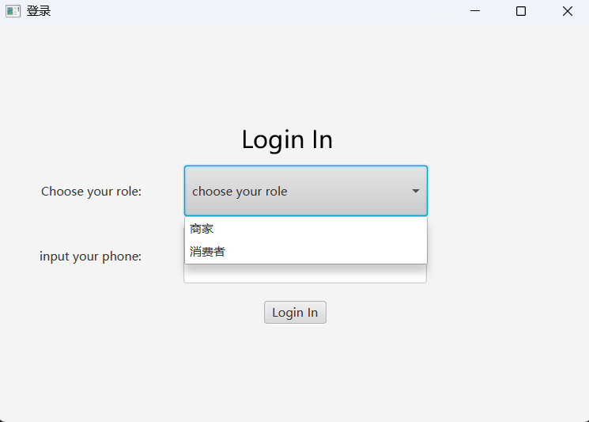
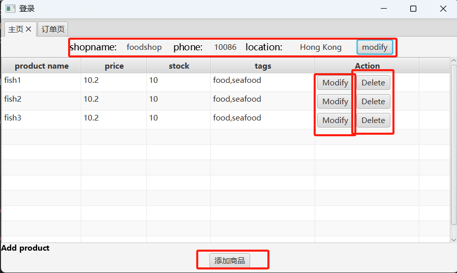
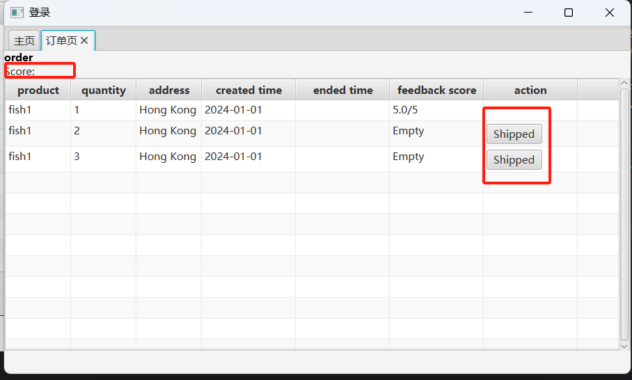
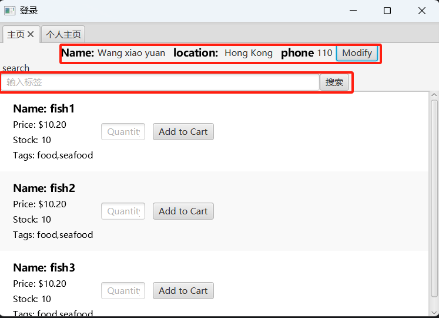
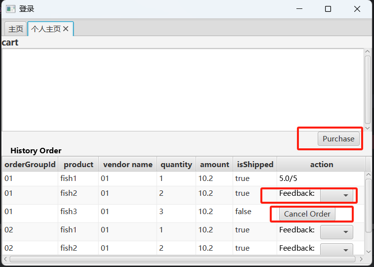

#  项目介绍：

# 功能划分
1. Login page
   - Merchant SearchMerchantById(String phone)
   - Consumer SearchConsumerById(String phone)
   - 
2. MerchantView:(确定Merchant 类中的各个getter类是否返回正确信息)
   - tab1:主页
      - merchant.updateMerchantInfo(String shopname,String phone, String address)
      - merchant.modifyProductInfo
      - merchant.deleteProductItem
      - merchant.addNewProduct
      - 
   - tab2:订单页
      - merchant.shipOrder
      - 
4. ConsumerView:
   - tab1:主页
      - consumer.updateConsumerInfo
      - consumer.getProductListBySearch
      - 
   - tab2：个人主页
      - consumer.createOrder
      - consumer.giveOrderFeedback
      - consumer.cancelOrder
      - 
      
